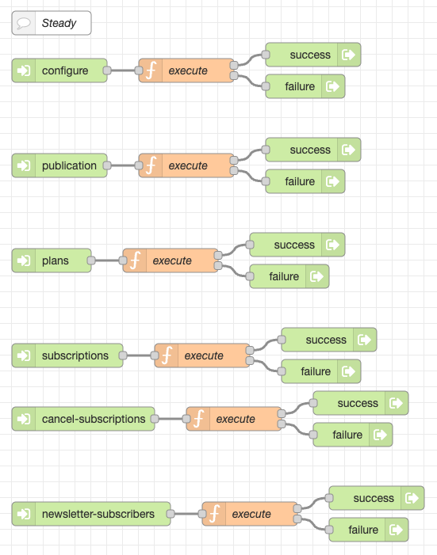
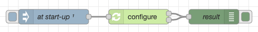
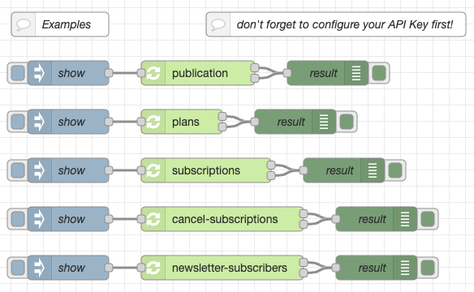

# node-red-flow-steady #

Node-RED Flow for the Steady API

This repository contains a set of simple flows for the [Steady API](https://developers.steadyhq.com/). [Steady](https://steadyhq.com/en) is a monetarization platform similar to [Patreon](https://www.patreon.com) or [Buy-me-a-Coffee](https://www.buymeacoffee.com/). Using the flows from this repo you may monitor and manage your subscriptions programmatically using Node-RED.

## Installation ##

This section shows you how to install Node.js, Node-RED and the flows from this repository - feel free to skip the steps for those components you already installed before.

### Node.js ###

"_[Node.js](https://nodejs.org/en) is a cross-platform, open-source server environment that can run on Windows, Linux, Unix, macOS, and more. Node.js is a back-end JavaScript runtime environment, runs on the V8 JavaScript engine, and executes JavaScript code outside a web browser._" (according to [Wikipedia](https://en.wikipedia.org/wiki/Node.js))

Start by [installing Node.js](https://nodejs.org/en) as described on their web page.

### Node-RED ###

"_[Node-RED](https://nodered.org/) is a flow-based, low-code development tool for visual programming developed originally by IBM..._" (according to [Wikipedia](https://en.wikipedia.org/wiki/Node-RED)).

If not already done, install Node-RED as described on their "[Get Started](https://nodered.org/#get-started)" page.

### Steady Flows ###

Finally import the contents of file [Steady-Flows.json](https://raw.githubusercontent.com/rozek/node-red-flow-steady/master/Steady-Flows.json) into a new worksheet.

## Configuration ##

## Examples ##

## License ##

[MIT License](LICENSE.md)
